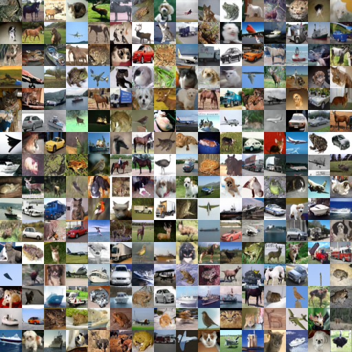
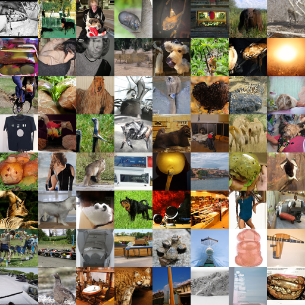

# Denoising Diffusion Probabilistic Models

Implementation of [Denoising Diffusion Probabilistic Models](https://proceedings.neurips.cc/paper/2020/file/4c5bcfec8584af0d967f1ab10179ca4b-Paper.pdf) by Ho et al.

  <table>
    <tr>
      <td align="center">
        <b>CIFAR-10</b> 
        
      </td>
      <td align="center">
        <b>ImageNet 64</b> 
        
      </td>
    </tr>
  </table>

